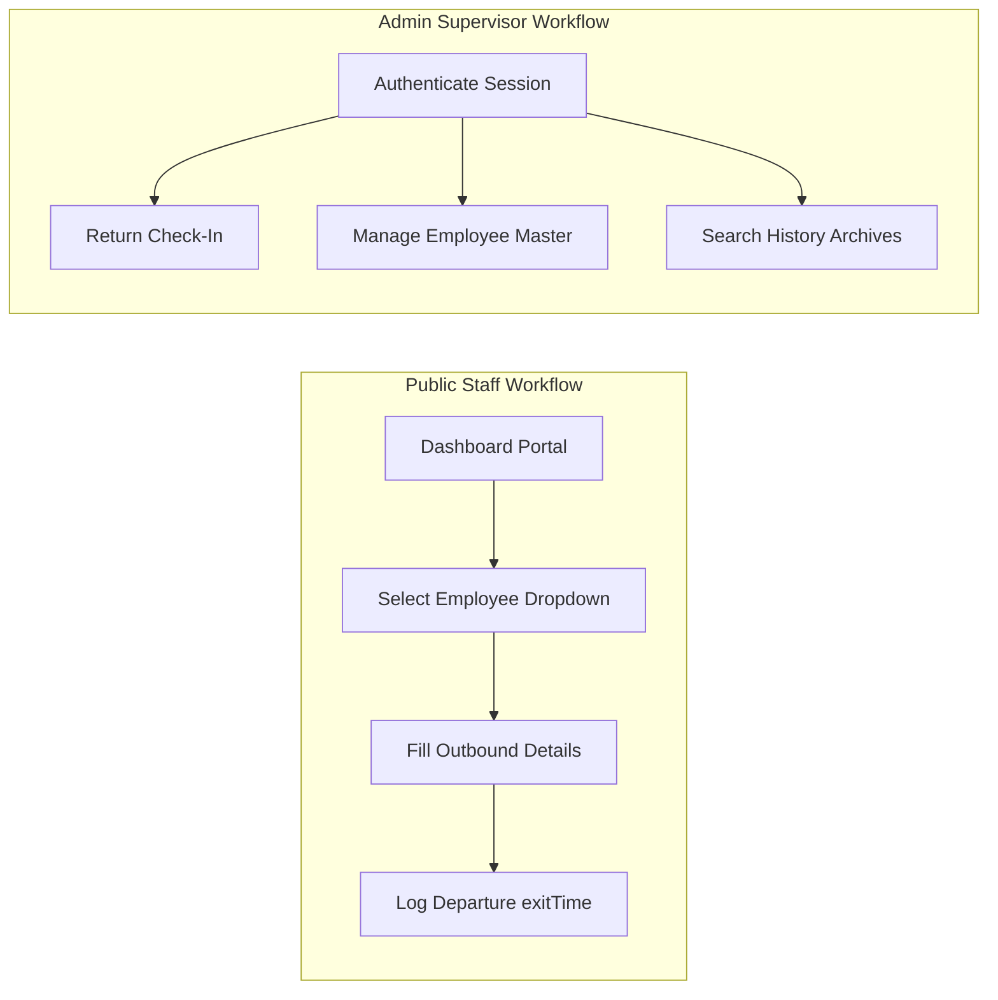
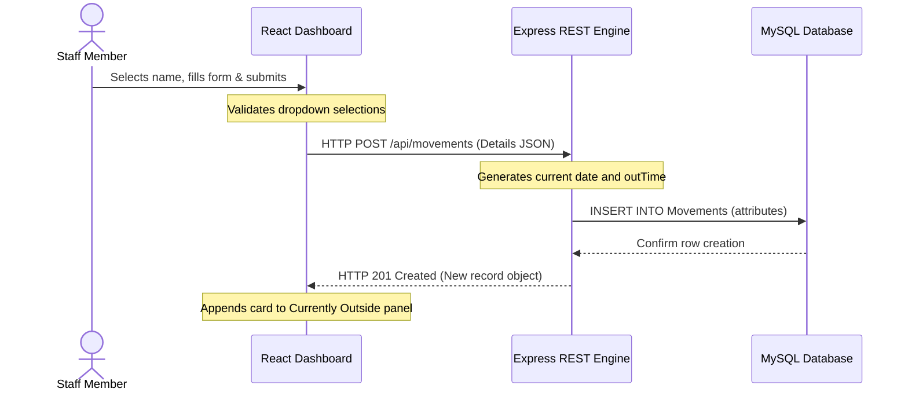
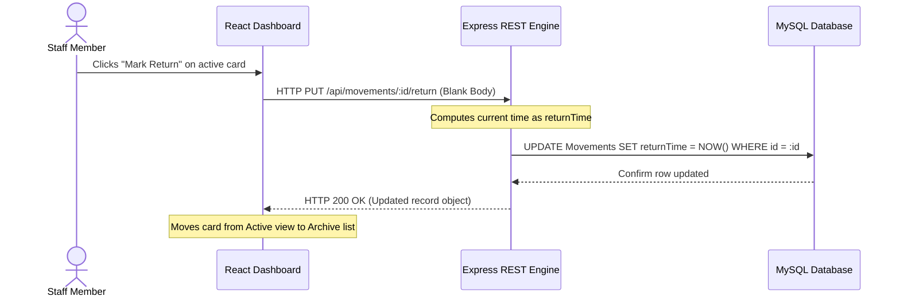

# KIMS ICT Personnel Movement Register
### Comprehensive Technical, Architecture & Operational Reference Manual

---

## Table of Contents
1. [System Architecture Overview](#1-system-architecture-overview)
2. [Technology Stack & Dependencies](#2-technology-stack--dependencies)
3. [Relational Database Architecture (MySQL)](#3-relational-database-architecture-mysql)
4. [System Architecture & Data Flow (Mermaid Flowcharts)](#4-system-architecture--data-flow-mermaid-flowcharts)
5. [Frontend Theme & Style Engine (Light/Dark Switcher)](#5-frontend-theme--style-engine-lightdark-switcher)
6. [Core Features & UI Limits (Red Alerts & Pagination)](#6-core-features--ui-limits-red-alerts--pagination)
7. [Installation & Operational Commands](#7-installation--operational-commands)

---

## 1. System Architecture & Operational Workflows

The KIMS ICT Personnel Movement Register is a full-stack real-time tracking application built to monitor when staff check out of their active departments and log returns. The application operates in two distinct modes: **Public Mode** (default dashboard terminal) and **Admin Mode** (secure administration interface).



### Core User Journeys

#### A. Employee Check-Out (Public Terminal)
1. **Access Terminal**: The user visits the root URL `/` which loads the main Public Dashboard.
2. **Form Entry**:
   - Under the **New Movement** form, the user selects their name from the dropdown. Only active employees are listed.
   - The user selects the supervisor to **Inform To** (e.g., HOD, Manager, Team Lead).
   - The user selects the **Visit Location** (e.g., General Hospital, Admin Block, E-Portal, Branch Office).
   - The user inputs the **Purpose of Visit**.
3. **Submit**: Clicking **Check Out** generates a POST request to the backend. The employee name is added to the active "Currently Outside" panel.

#### B. Return Check-In (Public Dashboard)
1. Any active outbound personnel card is visible in the **Currently Outside** panel on the right side of the dashboard.
2. The returning employee spots their name and clicks **Mark Return**.
3. The card immediately disappears from the active panel and is archived in the history database logs with a calculated duration of absence.

#### C. Administrator Oversight (/admin)
1. **Authorization**: Accessing `/admin` prompts the supervisor to log in using secure credentials (`admin` / `admin123`).
2. **Employee Master Directory**:
   - The admin can view the entire list of registered employees.
   - An inline edit modal permits correcting spellings, assigning departments, or marking employees as active/inactive.
   - An add form allows registering new staff with their specific ID and department.
3. **Global Archival**: The admin has access to the full **Movement Archive** page to filter logs by date range, names, and location, as well as purge incorrect entries.

---

## 2. Technology Stack & Dependencies

The application utilizes a decoupling strategy, separating the frontend Single Page Application (SPA) from the REST API backend service.

### Frontend Client
* **Framework**: React 18+ powered by Vite for lightning-fast HMR builds.
* **Routing**: React Router DOM (v6/v7) mapping root layouts `/`, `/dashboard`, and `/admin`.
* **State Management**: React State (`useState`) synchronizing local live clock intervals, theme preferences, and data fetches.
* **Icons**: `lucide-react` for responsive, high-density SVG symbols (Sun, Moon, Shield, Sparkles, User, Clock).
* **Styling**: Tailwind CSS utilizing standard variables for transitions and light/dark theme shifts.

### Backend Server
* **Engine**: Node.js utilizing Express REST API framework.
* **Database Driver**: `mysql2` connecting to the local MySQL server instance.
* **ORM**: Sequelize for object-relational mapping, model validation, and schema sync.
* **Authentication**: `jsonwebtoken` (JWT) providing session tokens for administrative routes.
* **Environment Configuration**: `dotenv` keeping database port, hosts, and JWT secrets out of source control.

---

## 3. Relational Database Architecture (MySQL)

The system automatically syncs two relational tables, `Employees` and `Movements`, managed dynamically using Sequelize migration.

```
+------------------+                   +------------------+
|    Employees     |                   |    Movements     |
+------------------+                   +------------------+
| id (PK, VARCHAR) |                   | id (PK, VARCHAR) |
| name (VARCHAR)   |                   | employeeId (FK)  |
| isActive (BOOL)  |                   | employeeName     |
| department (VAR) |                   | outTime (DATETIME|
+------------------+                   | returnTime (DATE)|
                                       | informTo (VARCHAR|
                                       | visitLocation    |
                                       | purpose (TEXT)   |
                                       | date (VARCHAR)   |
                                       +------------------+
```

### Table 1: `Employees`
Stores the corporate staff roster and department assignments.

| Attribute | SQL Datatype | Nullable | Primary Key | Description |
|---|---|---|---|---|
| `id` | `VARCHAR(255)` | No | Yes | Unique Employee ID (e.g. `203107`) |
| `name` | `VARCHAR(255)` | No | No | Employee Name (spelling spelling) |
| `isActive` | `TINYINT(1)` | No | No | Boolean status (`true` = Active, `false` = Suspended) |
| `department` | `VARCHAR(255)` | Yes | No | Associated department (`IT DATA CENTER` / `IT COMMAND CENTER`) |

### Table 2: `Movements`
Stores timestamps and details of all historical check-outs.

| Attribute | SQL Datatype | Nullable | Primary Key | Description |
|---|---|---|---|---|
| `id` | `VARCHAR(255)` | No | Yes | Unique record UUID |
| `employeeId` | `VARCHAR(255)` | No | No | Foreign mapping key referencing `Employees.id` |
| `employeeName`| `VARCHAR(255)` | No | No | De-normalized employee name snapshot |
| `outTime` | `DATETIME` | No | No | Departure exit timestamp |
| `returnTime` | `DATETIME` | Yes | No | Return check-in timestamp |
| `informTo` | `VARCHAR(255)` | No | No | Supervisor alerted of the departure |
| `visitLocation`| `VARCHAR(255)`| Yes | No | Destination location |
| `purpose` | `TEXT` | No | No | Detailed explanation of visit |
| `date` | `VARCHAR(255)` | No | No | Calendar string date (`YYYY-MM-DD`) |

---

## 4. System Architecture & Data Flow (Mermaid Flowcharts)

### Checkout Cycle Flow
The flowchart below maps out the sequence of checking out an employee.



### Return Check-In Flow


---

## 5. Frontend Theme & Style Engine (Light/Dark Switcher)

The application implements a premium, modern visual look shifting between **Dark Mode (Default)** and **Light Mode**. The color variables are managed as custom CSS custom properties in `client/src/index.css` and toggled dynamically.

### Custom Variables Definition
```css
/* --- index.css Theme Variables --- */
:root {
  /* Dark Mode Default values */
  --industrial-bg: #0B0F19;
  --industrial-card: #161B22;
  --industrial-border: rgba(212, 175, 55, 0.1);
  --industrial-text: #F3F4F6;
  --industrial-text-muted: #9CA3AF;
  --industrial-accent: #D4AF37; /* Premium Gold */
}

[data-theme='light'] {
  /* Light Mode values */
  --industrial-bg: #F8FAFC;
  --industrial-card: #FFFFFF;
  --industrial-border: #E2E8F0;
  --industrial-text: #1E293B;
  --industrial-text-muted: #64748B;
  --industrial-accent: #D4AF37; /* Premium Gold */
}
```

### Script Theme Switcher Hook
Implemented inside `Dashboard.jsx`, `Records.jsx`, and `Login.jsx` components:
```javascript
const [theme, setTheme] = useState(localStorage.getItem('theme') || 'dark');

useEffect(() => {
  document.documentElement.setAttribute('data-theme', theme);
  localStorage.setItem('theme', theme);
}, [theme]);

const toggleTheme = () => {
  setTheme(prev => prev === 'dark' ? 'light' : 'dark');
};
```

---

## 6. Core Features & UI Limits (Red Alerts & Pagination)

### Over-2-Hours Red Alert Logic (Public Dashboard Only)
To draw immediate visual attention to employees who have been out of the building for an extended period, the **Public Dashboard** applies a pulsing bright red color if an outbound movement exceeds 2 hours.

#### Frontend Evaluation Script
```javascript
// Located in Dashboard.jsx during record iteration
const isOver2Hours = !isAdmin && record.outTime && (currentTime - new Date(record.outTime)) > 2 * 60 * 60 * 1000;
```
If `isOver2Hours` resolves to `true`, the text classes are dynamically replaced:
```javascript
className={`text-xs font-black truncate ${isOver2Hours ? 'text-red-500 animate-pulse' : 'text-[var(--industrial-text)]'}`}
```

### Dashboard Pagination Size Limits
To prevent screen clutter and optimize rendering performance:
1. **Public Dashboard View**: Displays up to **10 active cards per page** in the "Currently Outside" column.
2. **Admin Dashboard View**: Displays up to **6 items per page** for a compact, clean look.

```javascript
const {
  paginatedData: paginatedActiveRecords,
  paginationInfo: activePaginationInfo,
  goToPage: goToActivePage
} = usePagination(activeRecords, isAdmin ? 6 : 10);
```

---

## 7. Installation & Operational Commands

### Development Setup
1. **Initialize Database**:
   - Create a MySQL database named `dashboard_db`.
   - Run the script located in `db/setup.sql` to generate the structure and seed the employee directory.

2. **Configure Environment**:
   - Create a file `/server/.env`:
     ```env
     PORT=5000
     DB_HOST=localhost
     DB_USER=root
     DB_PASS=your_mysql_password
     DB_NAME=dashboard_db
     JWT_SECRET=super_secret_jwt_key
     ```

3. **Install Dependencies & Start Backend**:
   ```bash
   cd server
   npm install
   npm run dev
   ```

4. **Install Dependencies & Start Frontend**:
   ```bash
   cd client
   npm install
   npm run dev
   ```

### Production Build
To bundle the frontend client for production delivery and serve it via the Node backend:
```bash
cd client
npm run build
```
The built client is served from `server/index.js` automatically.
